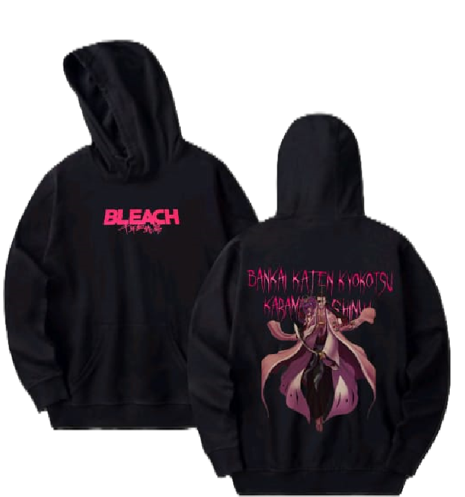
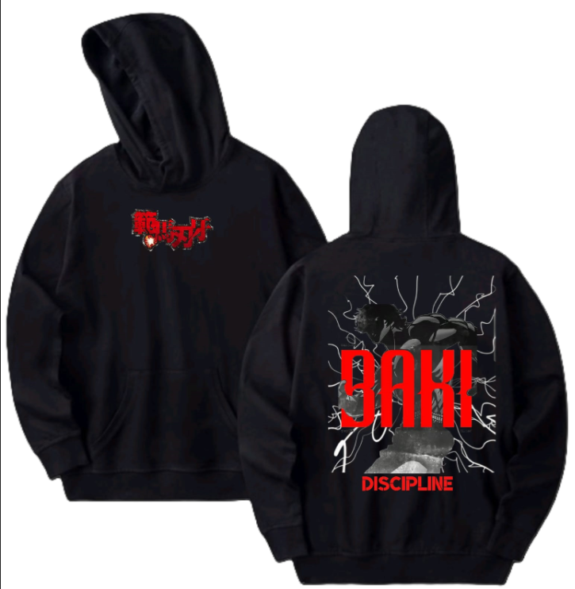

# Verve-Zenith
<html lang="en">
<head>
  <meta charset="UTF-8">
  <meta name="viewport" content="width=device-width, initial-scale=1.0">
  <title>Verve Zenith - Hoodie Store</title>
  
</head>
<body>
  <header>
    <h1>Verve Zenith Hoodie Store</h1>
  </header>
  <nav>
    <a href="#home">Home</a>
    <a href="#shop">Shop</a>
    <a href="#about">About</a>
    <a href="#contact">Contact</a>
  </nav>
  

    <h2>Our Exclusive Collection</h2>
    

      

        
        <h3>Attack on titan</h3>
        
20%off 800

        <button>cash on delivery</button>
      

      

        
        <h3>Ryomen Sukuna</h3>
        
20%off 800

        <button>cash on delivery</button>
      

      

        
        <h3>Shunsul kyoraku</h3>
        
20%off 800

        <button>cash on delivery</button>
      

      

        
        <h3>Baki</h3>
        
20%off 800

        <button>cash on delivery</button>
      

      

        
        <h3>Ryomen Sukuna</h3>
        
20%off800

        <button>uplode soon</button>
      

      

        
        <h3>Luffy</h3>
        
20%off800

        <button>upload soon</button>
      

    

  

  
  <footer>
    
To order please join on whatsapp and contact on Community Admin

    
© 2025 Verve Zenith | All rights reserved.

    
contacts +917874131655

    
contacts +919054619314

  </footer>
</body>
</html>
