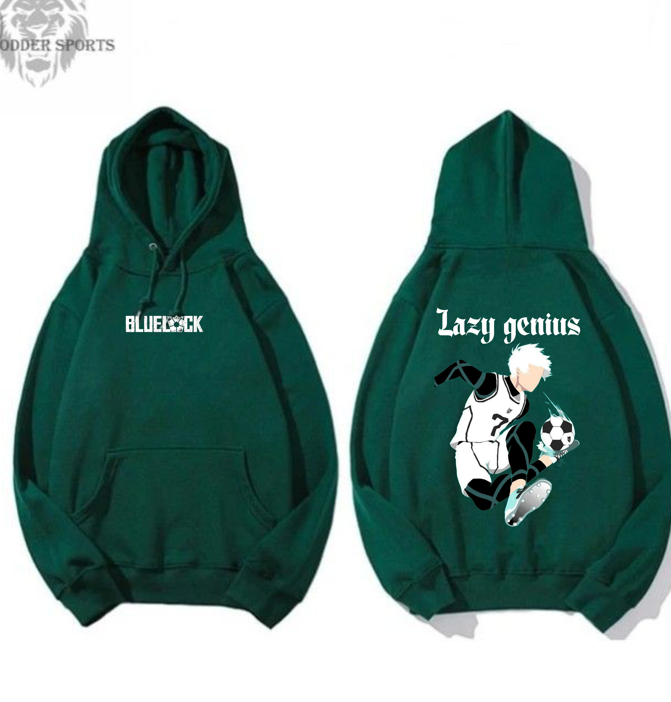
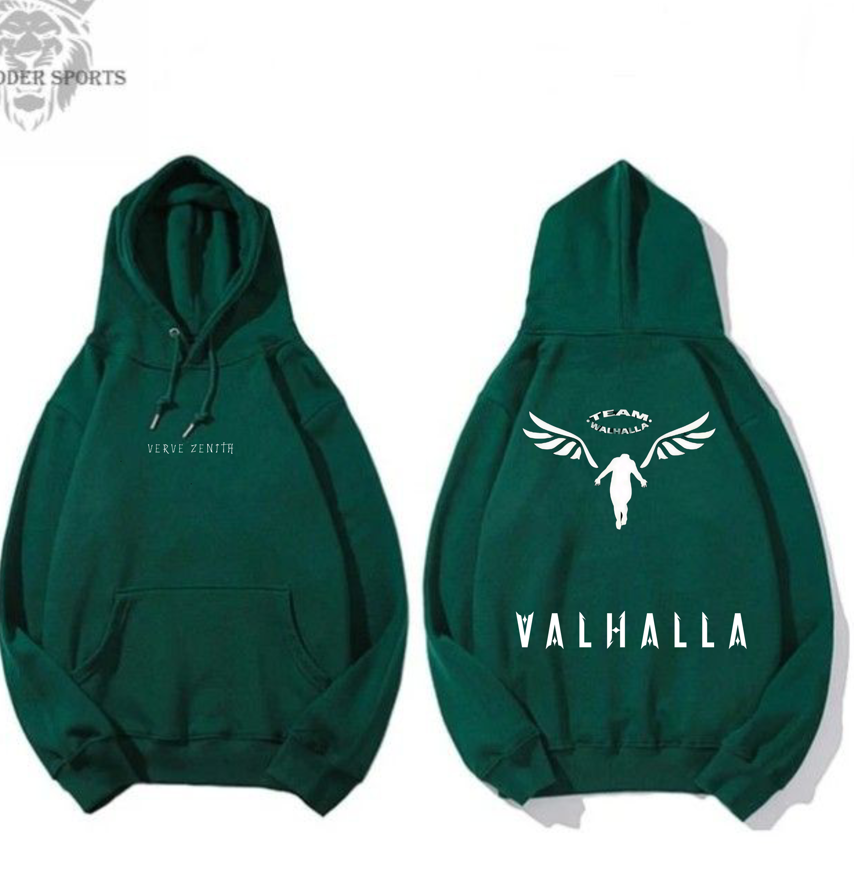

<!DOCTYPE html>
<html lang="en">
<head>
  <meta charset="UTF-8">
  <meta name="viewport" content="width=device-width, initial-scale=1.0">
  <title>Verve Zenith - Hoodie Store</title>
  
</head>
<body>
  <header>
    <h1>Verve Zenith Hoodie Store</h1>
  </header>
  <nav>
    <a href="#" onclick="showSection('home')">Home</a>
    <a href="#" onclick="showSection('shop')">Shop</a>
    <a href="#" onclick="showSection('contact')">Contact</a>
  </nav>

  <!-- Home Section -->
  <section id="home" class="active">
    <h2>Welcome to Verve Zenith</h2>
    

      
Explore our exclusive collection of hoodies and premium wear. Style yourself with Verve Zenith!

      

        <!-- Product 1 -->
        

          
        

        <!-- Product 2 -->
        

          
        

        <!-- Product 3 -->
        

          
        

        <!-- Product 4 -->
        

          
        

        <!-- Product 5 -->
        

          
        

        <!-- Product 6 -->
        

          
        

        <!-- Product 7 -->
        

          
        

        <!-- Product 8 -->
        

          
        

        <!-- Product 9 -->
        

          
        

        <!-- Product 10 -->
        

          
        

         <!-- Product 11 -->
         

          
        

         <!-- Product 12 -->
         

          
        

        <!-- Repeat the same structure for more products -->
      

    

  </section>

  <!-- Shop Section -->
  <section id="shop">
    <h2>Our Hoodie Collection</h2>
    

      <!-- Product 1 -->
      

        
        <h3>Ryomen Sukuna</h3>
        
₹800 (20% off)

        <a href="https://www.instagram.com/vervezenith_co?igsh=Mmk1aXE4M3oyMjN5" target="_blank">Buy Now</a>
      

      <!-- Product 2 -->
      

        
        <h3>Ryomen Sukuna</h3>
        
₹800 (20% off)

        <a href="https://www.instagram.com/vervezenith_co?igsh=Mmk1aXE4M3oyMjN5" target="_blank">Buy Now</a>
      

      <!-- Product 3 -->
      

        
        <h3>shunsui kyoraku</h3>
        
₹800 (20% off)

        <a href="https://www.instagram.com/vervezenith_co?igsh=Mmk1aXE4M3oyMjN5" target="_blank">Buy Now</a>
      

      <!-- Product 4 -->
      

        
        <h3>Toji fushiguro</h3>
        
₹800 (20% off)

        <a href="https://www.instagram.com/vervezenith_co?igsh=Mmk1aXE4M3oyMjN5" target="_blank">Buy Now</a>
      

      <!-- Product 5 -->
      

        
        <h3>Attack on titan</h3>
        
₹800 (20% off)

        <a href="https://www.instagram.com/vervezenith_co?igsh=Mmk1aXE4M3oyMjN5" target="_blank">Buy Now</a>
      

      <!-- Product 6 -->
      

        
        <h3>Baki Hanma</h3>
        
₹800 (20% off)

        <a href="https://www.instagram.com/vervezenith_co?igsh=Mmk1aXE4M3oyMjN5" target="_blank">Buy Now</a>
      

      <!-- Product 7 -->
      

        
        <h3>Monkey D.Luffy</h3>
        
₹800 (20% off)

        <a href="https://www.instagram.com/vervezenith_co?igsh=Mmk1aXE4M3oyMjN5" target="_blank">Buy Now</a>
      

      <!-- Product 8 -->
      

        
        <h3>Blue lock Nagi</h3>
        
₹800 (20% off)

        <a href="https://www.instagram.com/vervezenith_co?igsh=Mmk1aXE4M3oyMjN5" target="_blank">Buy Now</a>
      

      <!-- Product 9 -->
      

        
        <h3>Goku black</h3>
        
₹800 (20% off)

        <a href="https://www.instagram.com/vervezenith_co?igsh=Mmk1aXE4M3oyMjN5" target="_blank">Buy Now</a>
      

      <!-- Product 10 -->
      

        
        <h3>Vinland saga</h3>
        
₹800 (20% off)

        <a href="https://www.instagram.com/vervezenith_co?igsh=Mmk1aXE4M3oyMjN5" target="_blank">Buy Now</a>
      

      <!-- Product 11 -->
      

        
        <h3>Prince vegeta</h3>
        
₹800 (20% off)

        <a href="https://www.instagram.com/vervezenith_co?igsh=Mmk1aXE4M3oyMjN5" target="_blank">Buy Now</a>
      

      <!-- Product 12 -->
      

        
        <h3>Black clover Asta</h3>
        
₹800 (20% off)

        <a href="https://www.instagram.com/vervezenith_co?igsh=Mmk1aXE4M3oyMjN5" target="_blank">Buy Now</a>
      

      <!-- Add more products here as before -->
    

  </section>

  <!-- Contact Section -->
  <section id="contact">
    <h2>Contact Us</h2>
    

      
For orders and queries, join our WhatsApp community:

      
<strong>Contact:</strong> +91 9265481410 | +91 9998510217

      <a href="https://chat.whatsapp.com/J6rtbIlCElXH9pzFCiXUYx" target="_blank">Join WhatsApp</a>
    

  </section>

  <footer>
    
© 2025 Verve Zenith | All rights reserved.

  </footer>

  
</body>
</html>
